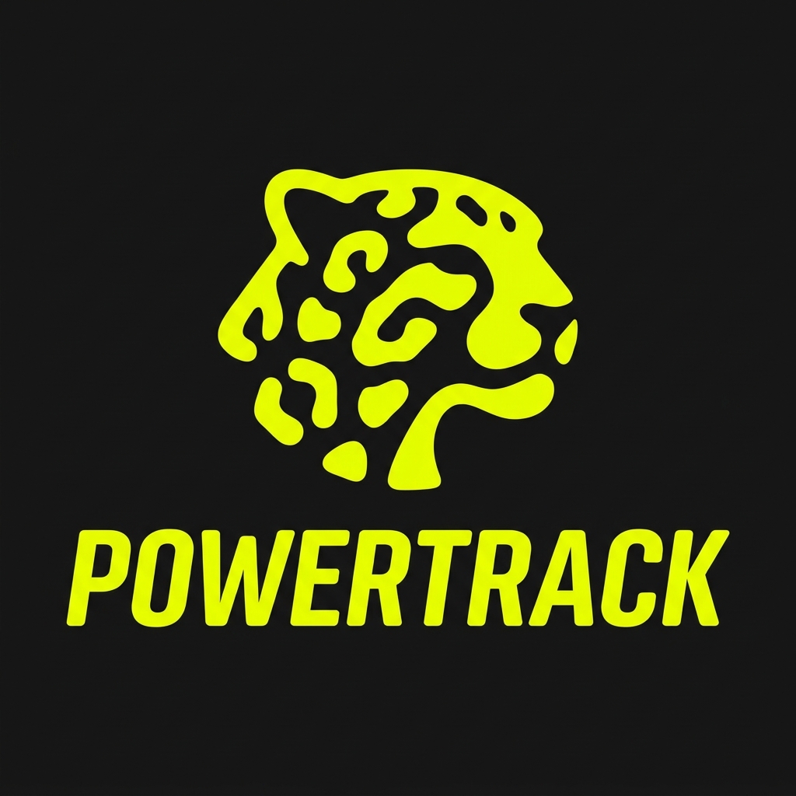
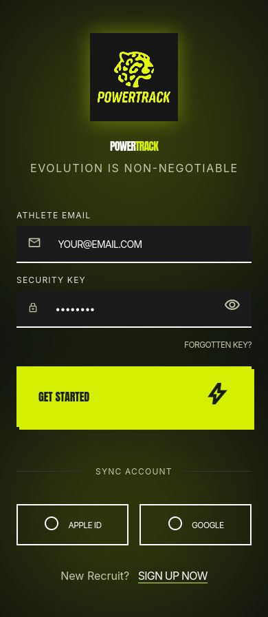
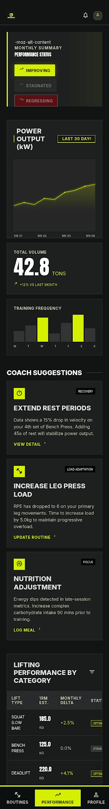
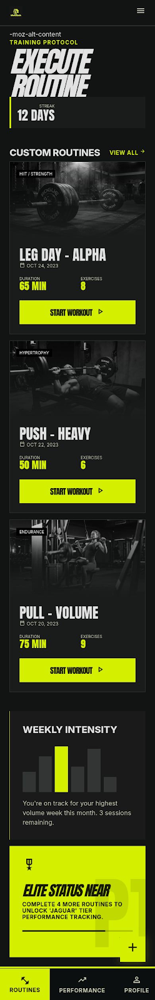
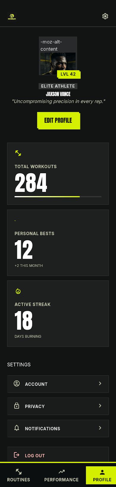

# View PowerTrack

Documentación de las vistas (mockups) de la aplicación PowerTrack.

---

## Logo

Pantalla de splash/bienvenida con el logo de la aplicación PowerTrack.



---

## Login / Register

Pantalla de acceso con las opciones para iniciar sesión o registrarse.



---

## Performance

Vista de desempeño/progreso del usuario a lo largo del entrenamiento.



---

## Routines

Vista de rutinas, donde el usuario consulta y gestiona sus rutinas de entrenamiento.



---

## Profile

Vista de perfil del usuario dentro de la app.



---

# Sistema de Diseño

## Configuración Base

```yaml
name: PowerTrack
colors:
  surface: '#121414'
  surface-dim: '#121414'
  surface-bright: '#38393a'
  surface-container-lowest: '#0c0f0f'
  surface-container-low: '#1a1c1c'
  surface-container: '#1e2020'
  surface-container-high: '#282a2b'
  surface-container-highest: '#333535'
  on-surface: '#e2e2e2'
  on-surface-variant: '#c6c9ab'
  inverse-surface: '#e2e2e2'
  inverse-on-surface: '#2f3131'
  outline: '#909378'
  outline-variant: '#464932'
  surface-tint: '#bad200'
  primary: '#ffffff'
  on-primary: '#2d3400'
  primary-container: '#d4f000'
  on-primary-container: '#5e6b00'
  inverse-primary: '#586400'
  secondary: '#c6c6c6'
  on-secondary: '#303030'
  secondary-container: '#474747'
  on-secondary-container: '#b5b5b5'
  tertiary: '#ffffff'
  on-tertiary: '#313030'
  tertiary-container: '#e5e2e1'
  on-tertiary-container: '#656464'
  error: '#ffb4ab'
  on-error: '#690005'
  error-container: '#93000a'
  on-error-container: '#ffdad6'
  primary-fixed: '#d4f000'
  primary-fixed-dim: '#bad200'
  on-primary-fixed: '#191e00'
  on-primary-fixed-variant: '#424b00'
  secondary-fixed: '#e2e2e2'
  secondary-fixed-dim: '#c6c6c6'
  on-secondary-fixed: '#1b1b1b'
  on-secondary-fixed-variant: '#474747'
  tertiary-fixed: '#e5e2e1'
  tertiary-fixed-dim: '#c8c6c5'
  on-tertiary-fixed: '#1c1b1b'
  on-tertiary-fixed-variant: '#474746'
  background: '#121414'
  on-background: '#e2e2e2'
  surface-variant: '#333535'
typography:
  display-xl:
    fontFamily: Anton
    fontSize: 72px
    fontWeight: '400'
    lineHeight: 72px
    letterSpacing: 0.02em
  headline-lg:
    fontFamily: Anton
    fontSize: 48px
    fontWeight: '400'
    lineHeight: 48px
  headline-lg-mobile:
    fontFamily: Anton
    fontSize: 36px
    fontWeight: '400'
    lineHeight: 36px
  headline-md:
    fontFamily: Inter
    fontSize: 24px
    fontWeight: '800'
    lineHeight: 28px
  body-lg:
    fontFamily: Inter
    fontSize: 18px
    fontWeight: '400'
    lineHeight: 28px
  body-md:
    fontFamily: Inter
    fontSize: 16px
    fontWeight: '400'
    lineHeight: 24px
  label-bold:
    fontFamily: Inter
    fontSize: 14px
    fontWeight: '700'
    lineHeight: 16px
    letterSpacing: 0.05em
  numeric-data:
    fontFamily: Anton
    fontSize: 32px
    fontWeight: '400'
    lineHeight: 32px
rounded:
  sm: 0.125rem
  DEFAULT: 0.25rem
  md: 0.375rem
  lg: 0.5rem
  xl: 0.75rem
  full: 9999px
spacing:
  base: 8px
  container-margin: 24px
  gutter: 16px
  section-gap: 48px
```

## Brand & Style
El sistema de diseño está pensado para entornos de fitness de alto rendimiento, enfocado en energía cruda, velocidad y precisión sin concesiones. El público objetivo son atletas dedicados y entusiastas del fitness que valoran la disciplina y el progreso medible.

La estética es **Aggressive Modernism**. Utiliza una base de modo oscuro de alto contraste para eliminar distracciones, enfocando la atención del usuario en sus métricas y objetivos de entrenamiento. Inspirado en ropa deportiva de alta gama, el sistema usa tipografía masiva y un enfoque "brutalist-lite" — combinando elementos estructurales robustos con una ejecución limpia y digital. La respuesta emocional buscada es urgencia, fuerza y confiabilidad de nivel profesional.

## Colores
La paleta está enfocada en alto contraste y alta visibilidad para asegurar legibilidad en ambientes de gimnasio con poca luz.

- **Primario (Electric Volt):** `#E2FF00`. Usado exclusivamente para acciones críticas, estados activos y destacados de desempeño. Debe usarse con moderación para mantener su efecto de "alarma".
- **Superficies y fondos:** La base es negro puro (`#000000`) para máxima eficiencia OLED. Los contenedores secundarios usan Charcoal (`#1A1A1A`) para crear profundidad sutil sin perder el tono oscuro agresivo.
- **Colores de estado:** Rojo puro para "Descanso" o "Detener", blanco puro para texto secundario.
- **Overlays:** Overlays negros al 40% de opacidad sobre fotografía atlética para asegurar legibilidad del texto manteniendo un look profesional y "gritty".

## Tipografía
El sistema tipográfico usa una estrategia de doble fuente para balancear impacto con utilidad.

- **Titulares:** Usa **Anton**. Su naturaleza condensada y pesada comunica fuerza y llena la pantalla con autoridad. Usar mayúsculas en todos los niveles Display y Headline para reforzar la voz de marca agresiva.
- **Cuerpo e interfaz:** Usa **Inter**. Da un contraste limpio y sistemático frente a los titulares expresivos, asegurando que datos e instrucciones de entrenamiento complejos se mantengan legibles.
- **Visualización de datos:** Para conteo de repeticiones, pesos y temporizadores, usar siempre Anton. La verticalidad de la fuente ayuda a leer números rápidamente a distancia mientras se entrena.

## Layout & Spacing
El layout sigue un modelo estricto de **Fluid Grid** pero con ritmo vertical exagerado.

- **Verticalidad:** Usar espacio en blanco significativo entre tarjetas de contenido principales (`section-gap`) para dar a la UI una sensación "premium athletic".
- **Grid:** En mobile, usar grid de 4 columnas con márgenes laterales de 24px. En desktop, grid de 12 columnas centrado con ancho máximo de contenido de 1200px.
- **Alineación:** Todo el texto debe estar alineado a la izquierda para mantener un recorrido de lectura rápido. Evitar alineación centrada excepto en temporizadores de cuenta regresiva o estados de éxito en modales.

## Elevation & Depth
La profundidad se logra mediante **Tonal Layering** y **contornos de alto contraste**, en lugar de sombras tradicionales.

- **Tier 1 (Base):** Negro puro `#000000`.
- **Tier 2 (Cards/Contenedores):** Charcoal `#1A1A1A`.
- **Tier 3 (Activo/Pop-overs):** Charcoal `#262626` con borde sólido de 1px, ya sea Primary Volt (para foco) o gris oscuro (neutral).
- **Sombras:** Si se usan, deben ser "duras" (0% blur, 4px offset) en Primary Volt para crear un efecto gráfico y brutalista en botones CTA.

## Shapes
El lenguaje de forma es **agudo y disciplinado**. Los elementos usan un redondeo mínimo para mantener una apariencia técnica, "de ingeniería".

- **Elementos estándar:** Botones y campos de entrada usan radio de `0.25rem` (4px).
- **Contenedores grandes:** Tarjetas de rutina y tiles de imagen usan radio de `0.5rem` (8px).
- **Rigurosidad:** Evitar formas de píldora o círculos, salvo para avatares de perfil. Cualquier elemento decorativo debe favorecer ángulos de 90 o 45 grados para evocar velocidad y precisión.

## Componentes
- **Botones:** Los botones primarios son sólidos en Volt (`#E2FF00`) con texto negro, usando Anton para el label. Los botones secundarios están delineados en blanco sin relleno.
- **Campos de entrada:** Relleno Dark Grey (`#1A1A1A`) con borde inferior únicamente (2px sólido blanco). Al enfocar, el borde cambia a Primary Volt.
- **Tarjetas de rutina (Workout Cards):** Fondo `#1A1A1A`. La mitad superior presenta fotografía atlética de alto contraste y desaturada. La mitad inferior contiene el título de la rutina en Anton y estadísticas en Inter.
- **Barras de progreso:** Pistas delgadas de 4px de alto. La porción sin llenar es `#262626`, la porción llena es un gradiente sólido de blanco a Primary Volt.
- **Chips/Tags:** Etiquetas rectangulares pequeñas con radio de borde de 0px. Usadas para "Leg Day," "HIIT," etc. Fondo negro con texto blanco en mayúsculas.
- **Listas:** Filas de alta densidad con separadores de 1px Dark Grey. Cada fila debe tener un "Chevron Right" en Primary Volt para indicar interactividad.
